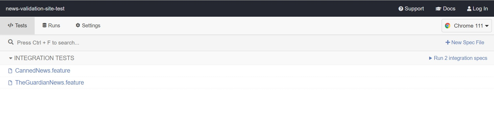
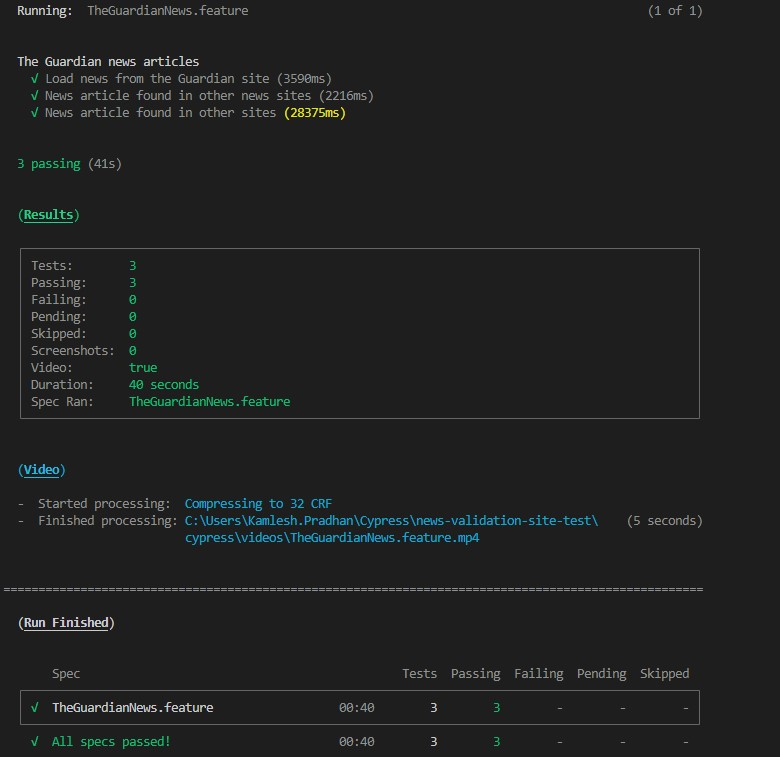

# news-validation-site-test
A suite of scenarios for news validation site to determine a news being fake or genuine.

## Quick Start Guides
---
1. Clone the repo
<pre>
> git clone -b main https://github.com/kamaleshpradhan/news-validation-site-test.git news-validation-site-test
</pre>
2. Install the packages
<pre>> npm install</pre>
3. Running test feature(s) From command line -
<pre>> npm run feature-1
> npm run feature-2
</pre>
From cypress runner - 
<pre>> npx cypress open</pre>
Wait for the Cypress runner to launch. Please run the command again if the lauch fails. Click the features to start execution on chorme brower.

---

## Sample feature
<code>
Feature: The Guardian news articles

    As a Product Owener
    I want to compare the news from The Guaradian with other sites
    In order to check fake news

    ## Valid news
    Scenario: News article found in other news sites
    Given some other prominent news sites
    When I search the news in google
    Then the news should be found in other news sites
</code>

---
## Sample Test Execution Results

---